# Introduction

This Tinderbox file supports creating a book, manuscript (beta), revealjs with [Quarto](https://quarto.org/).

[Tinderbox file for Quarto (Web version)](https://fryagbye.quarto.pub/tinderbox-file-for-quarto/)

You can easily make qmd files and _quarto.yml with it. 
Here is an example of books created with Quarto. 

* [R for Data Science (2e)](https://r4ds.hadley.nz/)(@Wickham2016Data)

You can preview Rchunk and Graphs (Mermaid Flowchart and Graphviz) in Tinderbox.

[](https://youtu.be/4BEroHg-F8Y)

My Workflow is shown below:

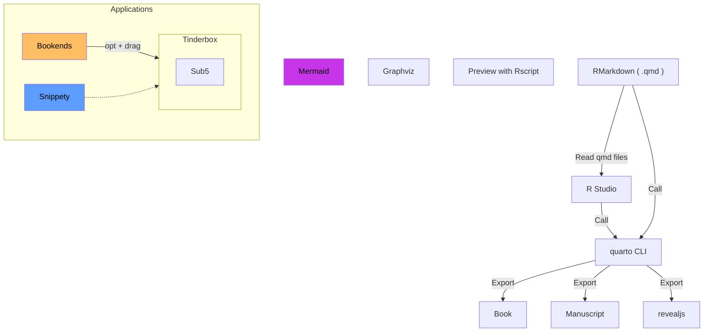

# Usage environment

Please refer to the output results of `quato check`.

* Quarto is using the released version 1.7.13 (pre-release)[^1]
* R is version 4.4.2
* I use luaLatex for output in Japanese. I have installed MacTex because TinyTex doesn't include it
* It may be better to uninstall TinyTex
* I have set it to use the `lightbox` extension (included in Quarto v1.4+)
* I have set it to use the `quarto-live` extension for revealjs ([quarto live](https://github.com/r-wasm/quarto-live))

[^1]: ~~Since the old headless mode has been removed from Chrome 132, Quarto v1.7.13 or later is required.~~

<details>
<summary>Quarto check output</summary>

```shell
# Quarto check output
Quarto 1.7.13

[✓] Checking environment information...
      Quarto cache location: /Users/tk4o2ka/Library/Caches/quarto
...
```
</details>

## Installed packages

<details>
<summary>Package List</summary>

| Name | Version | Built |
|------|---------|-------|
| askpass | 1.2.0 | 4.4.0 |
| backports | 1.4.1 | 4.4.0 |
| base | 4.4.0 | 4.4.0 |
| base64enc | 0.1-3 | 4.4.0 |
| bigD | 0.2.0 | 4.4.0 |
| bit | 4.0.5 | 4.4.0 |
| bit64 | 4.0.5 | 4.4.0 |
| bitops | 1.0-7 | 4.4.0 |

</details>

## RStudio Session information

```r
#| echo: false
sessionInfo()
```

Platform: aarch64-apple-darwin20
Running under: macOS 15.1.1
Matrix products: default
BLAS:   /System/Library/Frameworks/Accelerate.framework/Versions/A/Frameworks/vecLib.framework/Versions/A/libBLAS.dylib 
LAPACK: /Library/Frameworks/R.framework/Versions/4.4-arm64/Resources/lib/libRlapack.dylib;  LAPACK version 3.12.0
locale:

[1] en_US.UTF-8/en_US.UTF-8/en_US.UTF-8/C/en_US.UTF-8/en_US.UTF-8

time zone: Asia/Tokyo
tzcode source: internal
attached base packages:

[1] stats     graphics  grDevices utils     datasets  methods   base     

loaded via a namespace (and not attached):

[1] compiler_4.4.0 tools_4.4.0   
```

# Setting

1. Setting up with "TBXConfig" note

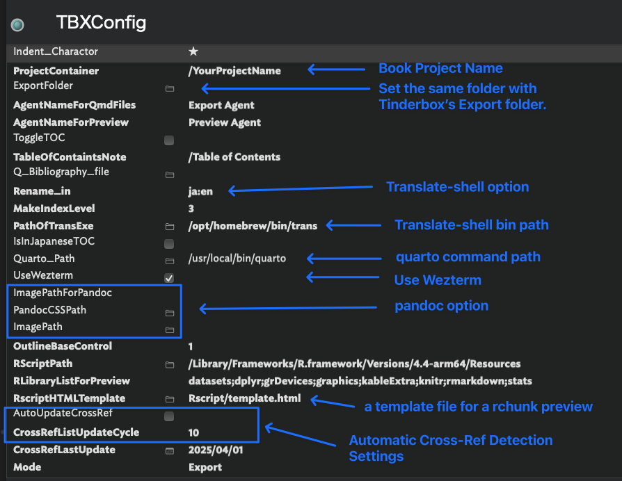

    You need to change the values of the following "TBXConfig" attributes for configuration.

* `$Indent_Charactor` → Set the symbol representing the depth of indentation. ( default value = ★ )

* ~~`$ExList` → List of notes excluded from cross-reference search ( default value = "List and Agent etc" )~~

* `$ProjectContainer`  →  Book Project Path for CrossRef Search and Label Lists 

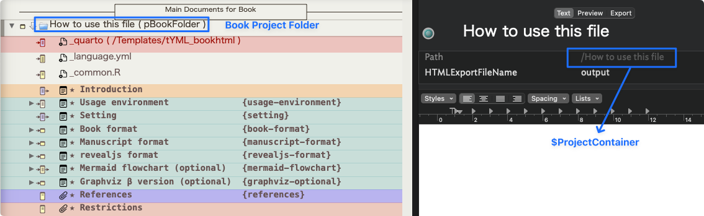{#fig-projectcontaierexample fig-alt="Project Contaier Example" fig-align="left" width=80%}  

* `$ExportFolder` → File path of exported files.

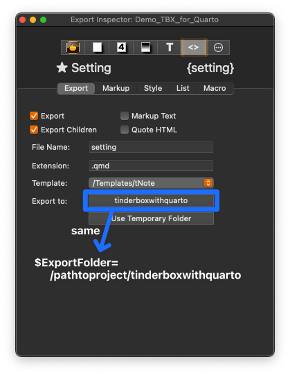{#fig-exportfoldersetting fig-alt="Export Folder Setting" fig-align="left" width=50%}

* `$ToggleTOC` → Toggle for Generating TOC. ( default value = false ) You can use quarto option for TOC in _quarto.yml. 

* `$Q_TableOfContainsNote` → **$Name** of TOC note. ( default value = Table of Contents )

* `$Rename_in` → [`translate-shell`](https://github.com/soimort/translate-shell) option setting `[SOURCES]:[TAGETS]. ( default value = ja:en )

* `$Q_PDFEngine` → Setting for [pdf engine](https://quarto.org/docs/output-formats/pdf-engine.html) This file is tested only with lualatex. ( default value = lualatex )

* ~~`$OutlineBaseControl` → Adjustment of section levels in Markdown. ( default = 1 )~~

    `$OutlineBaseControl` is enabled in Manuscript and revealjs project. This attribute is used in pSubfolderManuscript and pSubfolderRevealjs note.
     e.g. 

    * $OutlineBaseControl = 1 → \#\# Title

    


    * $OutlineBaseControl = 1 → \# Title 


* `$RScriptLibraryPath` → R Library Resource Path ( default Value )

    {#fig-rscript-libpath fig-alt="Rscript Library Path" fig-align="left" width=80%}
	


2. Making a `_quarto.yml`

    You can change the values of attributes of the "_quarto" note to change quarto options. The quarto options are attributes that start with "Q" in this file. The initial setting specified in `_quarto.yml` is for Japanese output. Please refer to [Quarto Book Structure](https://quarto.org/docs/books/book-structure.html) and [PDF Basics](https://quarto.org/docs/output-formats/pdf-basics.html) in detail.
    If you use [Custom Translations](https://quarto.org/docs/authoring/language.html#custom-translations), you need to make `$Q_Has_Language_YML` `true` and set `$Q_Language_YML` for the filename.
The "_language" note in this file is for translating to Japanese.

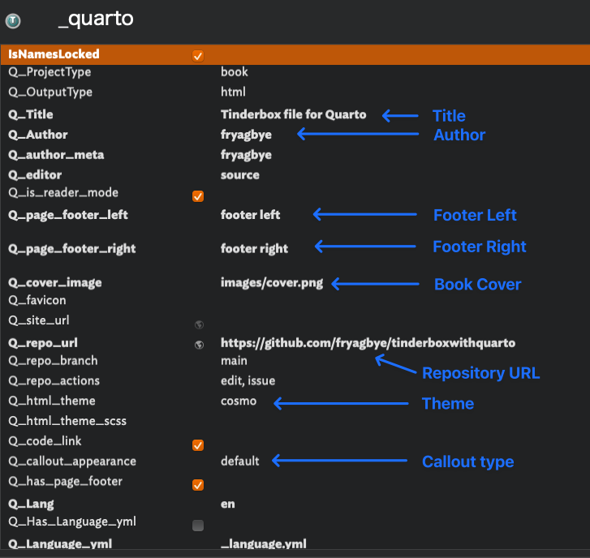


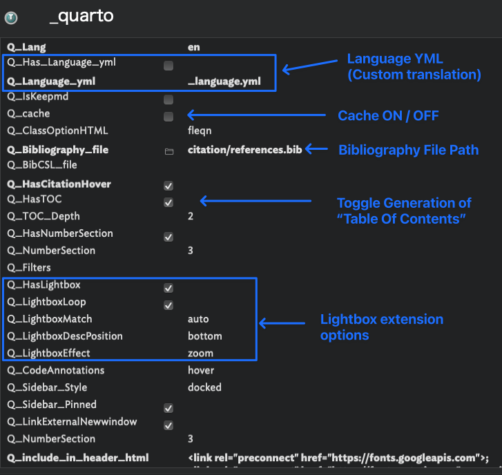


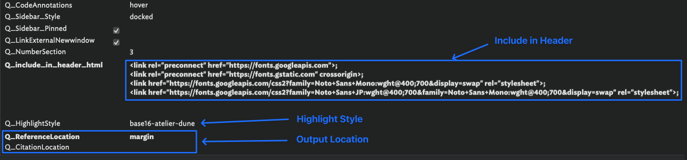


3. Changing the `_common.R` file. ( optional )

    You can set up `knitr` package options for R chunk.  
    


# Book format

 


# Make a New Book Project

You can start with the stamp that makes a new book project.
Only one book project is allowed per file.
The project container is created at the bottom and it has Label lists, _quarto.yml, and an index note.


If you use a virtual environment with Python and the stamps about quarto command, please set $Q_VenvActivateBinPath.
Before calling quarto commands, the stamps activate the virtual environment.
`r switch(out_type, latex = "\\raisebox{1ex -\\height/2}{\\includegraphics[height=2em]{screenshots/Lclick.png}}", html = "{fig-alt='左クリック' width=40px}")`：左クリック


# Make new notes


1. Make notes with Prototype pNote and pSubnote

    pNote is for Sections and pSubnote is for Subsections.
Please set the Prototype of pNote to level 1 and pSubnote below level.


 * When creating a note, please enter "#pNote" or "#pSubnote" following the title. (or apply the pNote Prototype or pSubnote to notes you make )

    e.g. Note title -> わが輩は猫である#pSubnote


     * The note title (`$Name`) is the header for pNote or pSubnote.


 * Depending on the hierarchy level, the level of the header also changes.

     e.g. If the title of pSubnote in level 2 depth is "わが輩は猫である", it will be output as follows when exporting.
     > \#\# わが輩は猫である

::: {#fig-make-newnote01 layout-ncol=2}


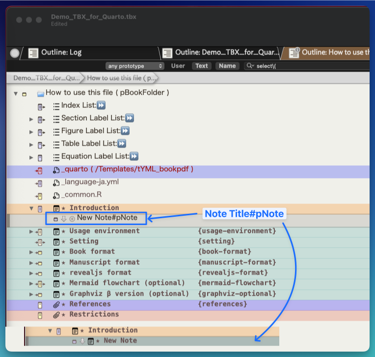


:::


2. Index.qmd

    In the quarto book format, **only one index.qmd is required**,  `$IsIndexqmd` of the index.qmd is set to `true`.
You can make the note for index.qmd with the pIndexQmd Prototype or make `$IsIndexqmd` of pNote  `true`.


## Special Notes Prototype


1. pReferenceQmd

 
    This prototype is inherited from pNote and $Text has a div with id `refs` to call a works cited list (below). ([Quarto Bibliography Generation](https://quarto.org/docs/authoring/citations.html#bibliography-generation))
    `::: {#refs}`
    `:::`

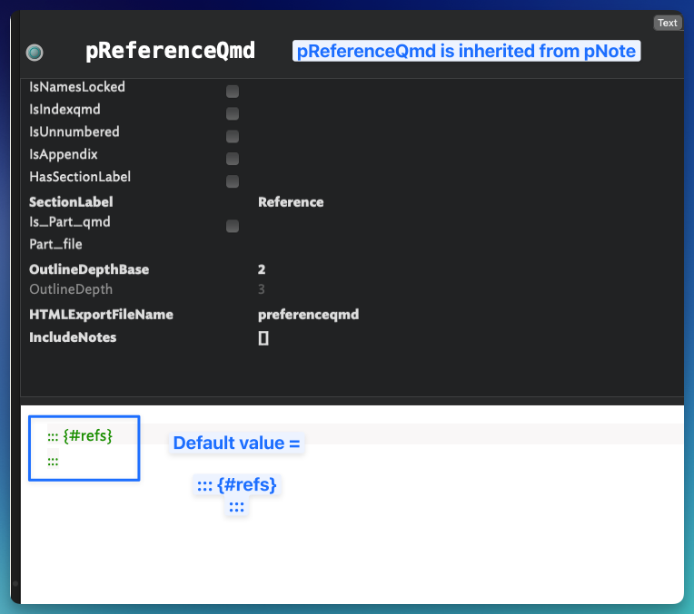


2. pAppendixQmd

     This prototype is inherited from pNote and $IsAppendix is `true`.

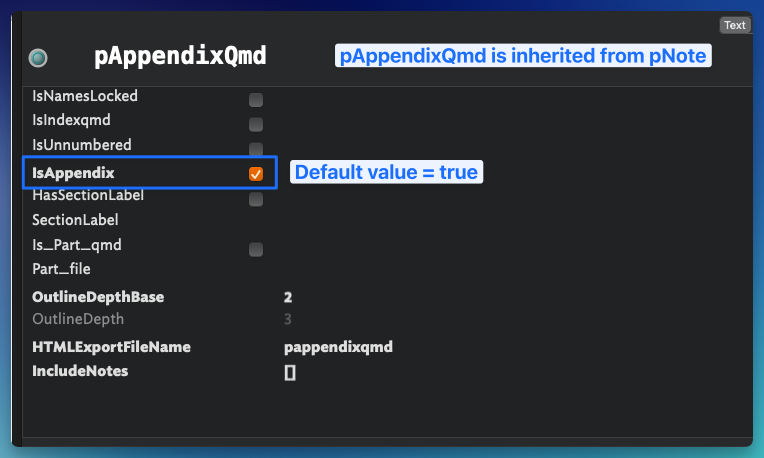


# Chunks and Graphs


1. R chunk and Python chunk notes

    You can create a pRChunk for an R chunk and a pPChunk for a Python chunk. The "Chunk & Graph: Make Chunk List" stamp generates a tag like ＜Lang:Tag Label➡️Figure Label＞.
These tags can be used to reference R chunks, Python chunks, Mermaid diagrams, or Graphviz code.
    Please do not insert tags in the middle of a sentence.

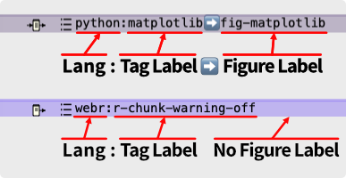

If tags called in your notes are changed or deleted, the warning is shown.
You can suppress the warning with  `$SuppresTagDetectWaring` in the project container note.


2. Rendered Preview in Text Pane(R chunks, Mermaid diagrams, and Graphviz only)

You can check the results of the code executed within an R chunk in the Preview screen. Similarly, the results of Mermaid and Graphviz code can also be displayed. However, this is not possible for Python.


# Rename HTMLExportFileName of a note with translation

There is a stamp **"Notes: Tranlate Section Labels"** that translates the Japanese title (`$Name`) into English and automatically sets `$HTMLExportFileName` [^translate-shell]. and you can set `$SectionLabel` with stamp "Set: Section Label". The labels of the section cannot be duplicated, so please modify them manually if necessary. In addition, you can change the language to be translated with `$Rename_in` in the TBX configuration note (**TBXConfig**). ( By default, from Japanese to English).

[^translate-shell]: [Translate-shell](https://github.com/soimort/translate-shell) installation required. 

```zsh
> brew install translate-shell
```


# Part in Book format

For Part, please refer to [Quarto's "Book Structure" reference](https://quarto.org/docs/books/book-structure.html).
pNote is compatible with quarto's **Part** or **Chapter**.
If pNote is at the bottom of pNote, the top pNote will be Part (Part ○), and the lower pNote will be Chapter (Chapter ○). You can place pNote at hierarchical level 2 only if you are under pNote of hierarchy level 1. 
In this case, the hierarchy level and header level are different, so the header level is set based on the user attribute `$OutlineDepthBase`.
pNote, which is treated as a Part, is turned on (`true`) for `$Is_Part_qmd`. The lower pNote contains the export file name (e.g. filename.qmd) of the pNote, which is Part, in `$Part_file`.
If a Part note is empty, only the title (`$Name`) of the note is reflected in _quarto.yml, as shown in the **"Dice"** in the example below. 
If the dice.qmd is not empty, the part title (as a level one header) as well as some introductory content for the part. 

```yml 
#_quarto.yml
chapters:
  - index.qmd
  - preface.qmd
  - part: "Dice" # if $Text("Dice").wordCount == 0 
  chapters: 
    - basics.qmd
    - packages.qmd
```

```yml
#_quarto.yml
chapters:
  - index.qmd
  - preface.qmd
  - part: dice.qmd # if $Text("Dice").wordCount >0 
    chapters: 
      - basics.qmd
      - packages.qmd
```

The figure below shows the export example when Part is supported and the output result of _quarto.yml.

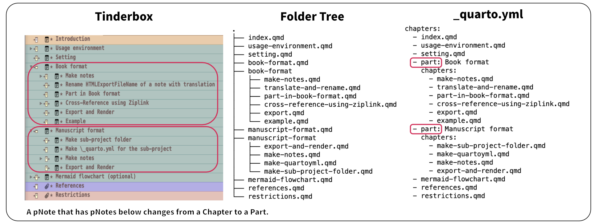


# Cross-Reference using Ziplink

In Quarto, labeled diagrams, tables, etc., can be mutually quoted. Label Lists are collected automatically (or manually). [^regrex]


Convert it to a quotable title (citation name starting with @) and create a note for the corresponding part. **Tinderbox**'s **Ziplink** function [^ziplink] is a function for easily pasting links to notebooks. It is diverted to make it easy to enter the quoted name. This makes it relatively easy to find and enter the quoted label even if the number increases.

[^regrex]: The diagrams and tables are extracted in regular expressions.


[^ziplink]: Please refer to "Text link creation via the Ziplinking method" in [A Tinderbox Reference File](https://acrobatfaq.com/atbref10/index/Automating_Tinderbox/Coding/Links/Text_Links/Text_link_creation_via_the_Ziplinking_method.html).(@Anderson2024Tinde)


## How to set the label of the diagram


### Image link in markdown format

Recognize and collect labels in a format that extends the markdown.
\!\[Test image](screenshots/toolbar.png){#fig-test fig-alt="test" fig-align="left" width=100%}

{#fig-test fig-alt="test" fig-align="left" width=100%}


## R chunk

Automatically recognize and collect R chunk labels in the following format (#| label: fig-xxx-ooo, etc.). The method of specifying a label in the curly bracket ({r fig-xxx-ooo}) is not supported. In the following example, you can quote @fig-airquality.


```{r}
#| echo: false
#| warning: false
#| label: fig-airquality
#| fig-cap: Temperature and ozone level.
#| fig-width: 5
#| fig-pos: H
#| fig-show: asis
library(ggplot2)
ggplot(airquality, aes(Temp, Ozone)) + 
  geom_point() + 
  geom_smooth(method = "loess")
```


## Python chunk


```{python}
#| echo: false
#| label: fig-numpy
#| fig-width: 5
#| fig-pos: H
#| fig-show: asis
import numpy as np
a = np.arange(15).reshape(3, 5)
a
```


```{python}
#| echo: false
#| label: fig-matplotlib
#| fig-width: 5
#| fig-pos: H
#| fig-show: asis
import matplotlib.pyplot as plt
fig = plt.figure()
x = np.arange(10)
y = 2.5 * np.sin(x / 20 * np.pi)
yerr = np.linspace(0.05, 0.2, 10)

plt.errorbar(x, y + 3, yerr=yerr, label='both limits (default)')
plt.errorbar(x, y + 2, yerr=yerr, uplims=True, label='uplims=True')
plt.errorbar(x, y + 1, yerr=yerr, uplims=True, lolims=True,
             label='uplims=True, lolims=True')

upperlimits = [True, False] * 5
lowerlimits = [False, True] * 5
plt.errorbar(x, y, yerr=yerr, uplims=upperlimits, lolims=lowerlimits,
             label='subsets of uplims and lolims')

plt.legend(loc='lower right')
plt.show(fig)
```


## How to set the label of the table

There are multiple ways to specify labels, but they are only supported if it is a table in markdown format and the label name is above, as shown in the example below.[^table-cross-ref]

[^table-cross-ref]: For other formats, please refer to [quarto cross-reference](https://quarto.org/docs/authoring/cross-references.html#tables).


```{.txt}


:明度・彩度の修飾子 {#tbl-brightness-saturation}

 
|項目|効果|
|----|------------|
|dark|暗くする|
|darker|より暗くする|
|darkest|最も暗くする|
|light| 明るくする|
```


:明度・彩度の修飾子 {#tbl-brightness-saturation}

 
|項目|効果|
|----|------------|
|dark|暗くする|
|darker|より暗くする|
|darkest|最も暗くする|
|light| 明るくする|


## Equations

Equation Example
Black-Scholes (@eq-black-scholes) is a mathematical model that seeks to explain


* Input


```latex

$$
ma^{2} \mathrm S^{2}
\frac{\partial^{2} \mathrm C}{\partial \mathrm S^2}  + \mathrm r \mathrm S \frac{\partial \mathrm C}{\partial \mathrm S}\ =  \mathrm r \mathrm C 
$$

```


* Output


$$
ma^{2} \mathrm S^{2}
\frac{\partial^{2} \mathrm C}{\partial \mathrm S^2}  + \mathrm r \mathrm S \frac{\partial \mathrm C}{\partial \mathrm S}\ =  \mathrm r \mathrm C 
$$ {#eq-black-scholes}


## How to quote

If you enter two square brackets "[[", the list will be displayed, so please enter a part of the label name. As the candidates are narrowed down, select the citation label you want to enter.


:How to quote

|Types of quotations  |Lable  |Quote|
|---|---|---|
|Chapters, Sections etc.   |#sec-   |\@sec-|
|Figures  |#fig- <br>#\| label:fig-<br>%%\| label:fig-<br> \/\/\| label:fig-<br>   |\@fig-|
|Charts　|#tbl-|\@tbl-|
|Equations | #eq-| \@eq-|


## Dummy links for cross-reference

You can create dummy links showing where each cross-reference, starting with the @ symbol in the section, figure, and table label lists, is cited.


1. execute the "Labels: Make Dummy Link Data For Cross-Reference" stamp


2. select cross-ref label notes ( start with "@" ) and execute the "Labels: Dummy Link between Reference and Selected notes" stamp.


## Restrictions on quoted labels


* The label before change or deletion remains because it cannot be detected even if the quoted label name is changed or deleted.


* Cross-ref detection is carried out by regular expression. If it is executed in the middle of input, it will be duplicated with a short label.

In this case, if necessary, delete the quoted label name in Stamp and perform the detection manually by following the steps below.


1. Labels: Clear Cross-Reference List（Delete all citation labels under the Reference List.）


2. Labels: Make Cross-Reference List（Re-detect the quoted label.）


# Export and Render


1. Export `_quarto.yml`

You can change the output format to "pdf" or "html"  with the stamp "Change quarto.yml template".
If you use a _language.yml, you export "_language" note (optional. See  @sec-setting Setting)


2. Export  `.qmd` files ( pNote notes only)

The pSubnote at the bottom of pNote at the time of output is all output as one qmd file in the state contained when pNote is exported. Therefore, it is OK to export by selecting only pNote to the "output" folder. In addition, pSubnote does not require output, but if you export, it is set to output as a text file (extension .txt).
If you select the pNote notes below "Export Agent" and output it, ~~then execute the "Move qmd files" stamp~~, you can overwrite the qmd file directly to `./output` (=`$HTMLExportFileName` of your project folder) ( @fig-output-tree). This method avoids considering the folder structure when referencing image files with a relative path.

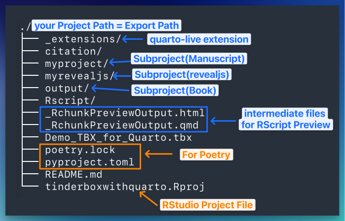{#fig-output-tree}


3. Preview HTML output. 


    * Terminal application 


```zsh
# preview
# quarto preview "project name" (quarto command options)
e.g. 
> quarto preview output
```


    * You can execute the command with the stamp "Quarto: Book Preview ( Select Export Agent )" 


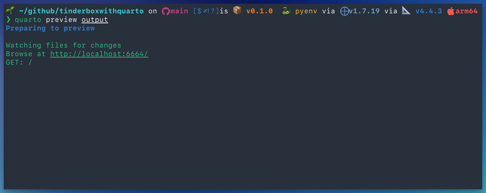{#fig-quarto-preview}


4. Render pdf or html.


    * Terminal application 


```zsh
> quarto render output
```


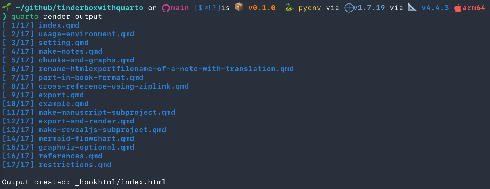{#fig-quarto-render}


* You can execute the command with the stamp "Quarto: Book Render ( Select For Export ) 

    You can use RStudio for preview and render.


# Example


[Example HTML](https://fryagbye.quarto.pub/tinderbox-file-for-quarto/)


[Example PDF](https://github.com/fryagbye/tinderboxwithquarto/blob/61f3d4e8e09e16c57ac3382f63d8f12af2dc7f3a/output/_bookpdf/Tinderbox-file-for-Quarto.pdf) 


# Manuscript format


# Make a New Manuscript Project

you can start with the stamp that makes a new manuscript project.
A Manuscript project can have multiple projects in one file.


If you use a virtual environment with Python and the stamps about quarto command, please set $Q_VenvActivateBinPath.
Before calling quarto commands, the stamps activate the virtual environment.


# Make sub-project folder

Make a note for the sub-project with **pSubfolderManuscript** like this ( _quarto_manuscript ).


## Make notes

The manuscript has only one qmd file. The qmd file name is set in _quarto.yml (_quarto_manuscript).


### Front Matter and Subnote


1. pFrontmatterManuscript

    
    This is a qmd file that contains a Front Matter. When you export, it has contents of descendants.
You can set data for author(s) with the path of note with pAuther notes. ( like Authors )


2. pSubnoteManuscript

    This is a dummy file for pFrontmatterManuscript. The markdown level depends on the indent level and `$OutlineBaseControl` of of the subproject folder.

```
($OutlineDepthBase + $OutlineBaseControl(collect(ancestors,$Path)[-1])) * "#" 
```


# Export and Render


1. Export

    You have to export _quarto.yml ( _quarto_manuscript ) and one qmd ( main ) in the sub-project folder.


2. Activate a virtual environment

if you use a virtual environment, activate it.
e.g.

```zsh
> poetry shell
```


3. Render sub-project


```zsh
# quarto render "your project name"
> quarto render myproject
# For preview
> quarto preview myproject --to html 
```


# revealjs format


# Make a New revealjs Project

you can start with the stamp that makes a new revealjs project.
A revealjs project can have multiple projects in one file.

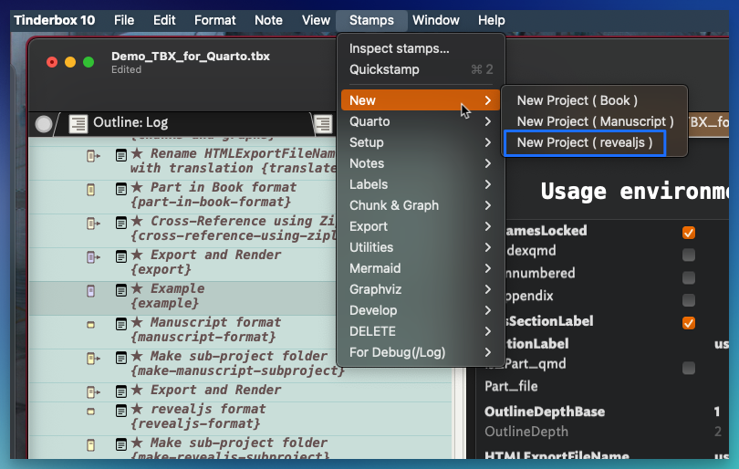

If you use a virtual environment with Python and the stamps about quarto command, please set $Q_VenvActivateBinPath.
Before calling quarto commands, the stamps activate the virtual environment.


# Make sub-project folder

Make a note for the sub-project with **pSubfolderRevealjs** .


## Front Matter and Subnote


1. pFrontmatterRevealjs

    
    This is a qmd file that contains a Front Matter. When you export, it has descendants' contents.


2. pSubnoteRevealjs

    This is a dummy file for pFrontmatterRevealjs. The markdown level depends on the indent level and `$OutlineBaseControl` of the subproject folder.

```
($OutlineDepthBase + $OutlineBaseControl(collect(ancestors,$Path)[-1])) * "#" 
```


3. Quote chunk code blocks

    You can chunk code blocks with a quote tag like the one below from a child note (pRChunk or pPChunk).
    <Lang:chunknotename>
 


## quarto-live extention (β version)

This file supports [quarto-live](https://r-wasm.github.io/quarto-live/).
You add the quarto-live extension to your subproject path.
(If you add it to the project root folder and call it with a relative path, an error will occur.)


## Example


[Example live-revealjs](https://fryagbye.quarto.pub/quarto-presentations/#/title-slide)


# Mermaid flowchart

This file can generate Mermaid flowchart from notes, links.


* Container notes -> Subgraphs ( pMFSubgraph )


* Non Container notes -> Nodes ( pMFNode)

Work Flow is a sample of Mermaid flowchart.  
Please check it in Map view.
You need to use pre-release version [^chromeheadlessmodeissue]

[^chromeheadlessmodeissue]:Since the old headless mode has been removed from Chrome 132, Quarto v1.7.13 or later is required.([Transition to Chrome new headless mode · Issue #10532 · quarto-dev/quarto-cli](https://github.com/quarto-dev/quarto-cli/issues/10532))


## How to use


1. You make a container noto for Flowchart and set pMFContainer.


2. You make notes ( pMFNode) and links. 


3. You choose a direction for drawing like TD or LR.($M_Direction)


4. Run the stamp ( `Mermaid: Make a Flowchart` ).


5. Prototypes of container notes **has** a child note change from pMFNode to pMFContainer automatically by the stamp.


6. The note (pMFContainer) has the code for mermaid flowchart.

<br>

[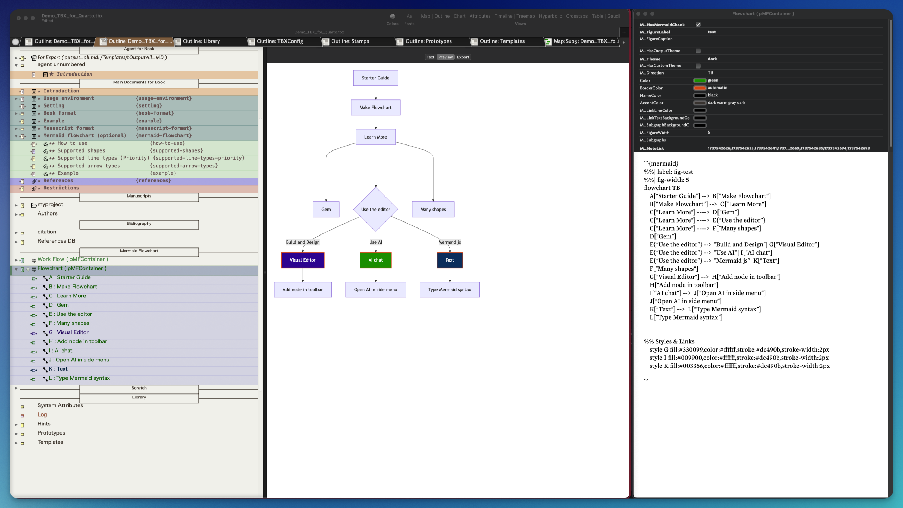](https://youtu.be/of2TkCyJ2xY)


## Supported shapes


* rectangle (<- normal and other shapes)


* rounded


* oval


* lozenge


* diamond


* hex


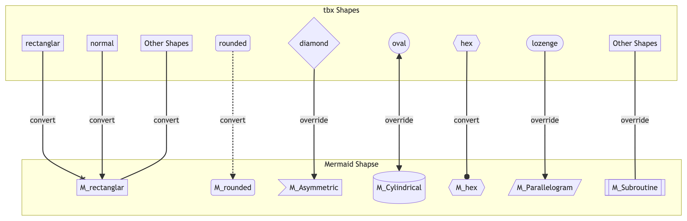


## Supported line types (Priority)


* normal 	 -->			(4th)


* bold     	 ==>			(3rd)


* dotted  	 -.->		    (2nd)


* invisible	 ~~~		   	(1st)


## Supported arrow types


* arrow only 


## Example


```{mermaid} 
%%| label: fig-flowchart
%%| fig-width: 5
flowchart TB
    A["Christmas"] -->|"Get money"| B["Go shopping"]
    B["Go shopping"] -->  Sub1["Let me think"]
    C["Laptop"]
    D["iPhone"]
    E["Car"]
 subgraph Sub1["Let me think"]
    C
    D
    E
end 
 subgraph Sub2["Subgraph"]
    A
    B
    Sub1
end 
    Sub1["Let me think"] -->|"One"| C["Laptop"]
    Sub1["Let me think"] -->|"Two"| D["iPhone"]
    Sub1["Let me think"] -->|"Three"| E["Car"]
%% Styles & Links
    style Sub2 fill:#eeebe9,color:#000000,stroke:#dc490b,stroke-width:2px
```


# Graphviz β version


## How to use


1. You make a container noto for the graph and set pGContainer.


2. You make notes ( pGNode) and links. **You can't make links to cluster (subgraph)**.


3. You choose a direction for drawing like TB or LR.($GG_Rankdir)


4. You can choose a Layout Engin like `dot`,  `neato`, `fdp` and so on.


4. Change attributes for Graphviz.


    * Attributes starting with `GG_` are for the Subgraph ( cluster ) options


    * Attributes starting with `GN_` are for the Note options


    * Attributes starting with `GE_` are for the Edge options


4. Run the stamp ( `Graphviz: Make a Dot graph` ).


5. Prototypes of container notes **have** a child note change from pGNode to pGContainer automatically by the stamp.


6. The note (pGContainer) has the code for Graphviz.


[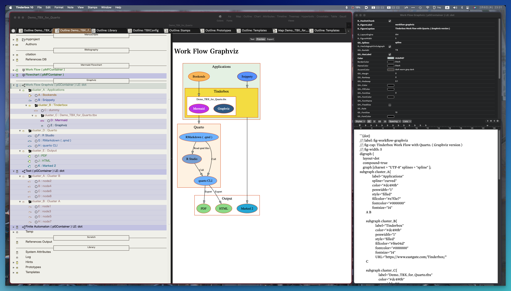](https://youtu.be/fayHy-Ikr5I)


## Example

 @fig-workflow-graphviz and @fig-Test.


```{dot}
//| label: fig-Test
//| fig-cap: Graphviz Test
digraph {
    layout=dot
    compound=true
    graph [charset = "UTF-8" ];
subgraph cluster_A{
                label="Cluster B"
                color="#000000"
                penwidth="1"
                style="filled"
                fillcolor="#ffffff"
                fontcolor="#000000"
        "node2" "node4" "node6" "node8" 
}

subgraph cluster_B{
                label="Cluster A"
                color="#000000"
                penwidth="1"
                style="filled"
                fillcolor="#ffffff"
                fontcolor="#000000"
        "node1" "node3" "node5" "node7" 
}


"node2" [ style="filled" ]
"node4" [ style="filled" ]
"node6" [ style="filled" ]
"node8" [ style="filled" ]
"node1" [ style="filled" ]
"node3" [ style="filled" ]
"node5" [ style="filled" ]
"node7" [ style="filled" ]

"node1" -> "node2" [label = "1" fillcolor="#ffffff" fontcolor="#000000" ]
"node3" -> "node4" [label = "2" fillcolor="#ffffff" fontcolor="#000000" ltail = "cluster_B" ]
"node5" -> "node6" [label = "3" fillcolor="#ffffff" fontcolor="#000000" lhead = "cluster_A" ]
"node7" -> "node8" [label = "4" fillcolor="#ffffff" fontcolor="#000000" lhead = "cluster_A" ltail = "cluster_B" ]
}
```


# References


Anderson, Mark. 2024. “A Tinderbox Reference File.” 2024.
Wickham, Hadley, and Garrett Grolemund. 2016. R for Data Science: Import, Tidy, Transform, Visualize,
and Model Data. “O’Reilly Media, Inc.”


# Restrictions

It seems that the section label customization function cannot be used in the latest release [ref. Cross-references on unnumbered pages fail (PDF) or are mislabeled (HTML)](https://github.com/quarto-dev/quarto-cli/issues/5946). 
If you turn on `$IsUnnumbered` and `$HasSectionLabel`, the display of the quote will be fixed to the number + title, so please turn off `$IsUnnumbered`.
Please do not use parentheses in note titles. The section label list is not being generated correctly.


