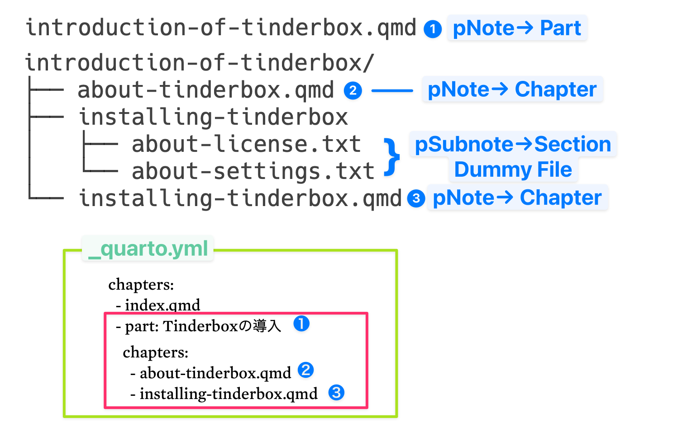

# Introduction 

This tinderbox file supports creating a book with [Quarto](https://quarto.org/).

You can make qmd files and _quarto.yml easily with it. 
Here is an example of books created with Quarto.

* [R for Data Science (2e)](https://r4ds.hadley.nz/)

# Table of Contents 

1. [Introduction](#introduction)
2. [Usage Environment](#usage-environment)
3. [Configuration and Setup](#configuration-and-setup)
4. [Creating Notes](#creating-notes)
5. [Cross-Referencing with Ziplink](#cross-referencing-with-ziplink)
6. [Exporting the Project](#exporting-the-project)
7. [Restrictions](#restrictions)
8. [Example](#example)
9. [References](#references)


# Usage environment 

Please refer to the output results of `quato check`.

* quarto is using the released version 1.5.57.
* R is version 4.4.0
* I use luaLatex for output in Japanese. I have installed MacTex because TinyTex doesn't include it.
* It may be better to uninstall TinyTex.
* I have set it to use `lightbox` extension ( included in Quarto v1.4+.)


```
# Quarto check output
Quarto 1.5.57
[✓] Checking versions of quarto binary dependencies...
      Pandoc version 3.2.0: OK
      Dart Sass version 1.70.0: OK
      Deno version 1.41.0: OK
      Typst version 0.11.0: OK
[✓] Checking versions of quarto dependencies......OK
[✓] Checking Quarto installation......OK
      Version: 1.5.57
      Path: /Applications/quarto/bin

[✓] Checking tools....................OK
      TinyTeX: (not installed)
      Chromium: (not installed)

[✓] Checking LaTeX....................OK
      Using: Installation From Path
      Path: /usr/local/texlive/2024/bin/universal-darwin
      Version: 2024

[✓] Checking basic markdown render....OK

[✓] Checking Python 3 installation....OK
      Version: 3.12.7
      Path: /Users/tk4o2ka/github/tinderboxwithquarto/.venv/bin/python3
      Jupyter: 5.7.2
      Kernels: python3

[✓] Checking Jupyter engine render....OK

[✓] Checking R installation...........OK
      Version: 4.4.0
      Path: /Library/Frameworks/R.framework/Resources
      LibPaths:
        - /Library/Frameworks/R.framework/Versions/4.4-arm64/Resources/library
      knitr: 1.46
      rmarkdown: 2.26

[✓] Checking Knitr engine render......OK
```


## RStudio Session information { #sec-session-information }
```
R version 4.4.0 (2024-04-24)
Platform: aarch64-apple-darwin20
Running under: macOS 15.0.1

Matrix products: default
BLAS:   /Library/Frameworks/R.framework/Versions/4.4-arm64/Resources/lib/libRblas.0.dylib 
LAPACK: /Library/Frameworks/R.framework/Versions/4.4-arm64/Resources/lib/libRlapack.dylib;  LAPACK version 3.12.0

locale:
[1] en_US.UTF-8/en_US.UTF-8/en_US.UTF-8/C/en_US.UTF-8/en_US.UTF-8

time zone: Asia/Tokyo
tzcode source: internal

attached base packages:
[1] stats     graphics  grDevices utils     datasets  methods   base     

other attached packages:
 [1] gtExtras_0.5.0   gt_0.10.1        kableExtra_1.4.0 knitr_1.46      
 [5] lubridate_1.9.3  forcats_1.0.0    stringr_1.5.1    dplyr_1.1.4     
 [9] purrr_1.0.2      readr_2.1.5      tidyr_1.3.1      tibble_3.2.1    
[13] ggplot2_3.5.1    tidyverse_2.0.0 

loaded via a namespace (and not attached):
 [1] utf8_1.2.4        generics_0.1.3    xml2_1.3.6        stringi_1.8.3    
 [5] hms_1.1.3         digest_0.6.35     magrittr_2.0.3    evaluate_0.23    
 [9] grid_4.4.0        timechange_0.3.0  fastmap_1.1.1     jsonlite_1.8.8   
[13] rematch2_2.1.2    fansi_1.0.6       viridisLite_0.4.2 scales_1.3.0     
[17] textshaping_0.3.7 cli_3.6.2         rlang_1.1.3       munsell_0.5.1    
[21] withr_3.0.0       yaml_2.3.8        tools_4.4.0       tzdb_0.4.0       
[25] colorspace_2.1-0  pacman_0.5.1      paletteer_1.6.0   vctrs_0.6.5      
[29] R6_2.5.1          lifecycle_1.0.4   htmlwidgets_1.6.4 ragg_1.3.0       
[33] fontawesome_0.5.2 pkgconfig_2.0.3   pillar_1.9.0      gtable_0.3.5     
[37] glue_1.7.0        systemfonts_1.0.6 xfun_0.43         tidyselect_1.2.1 
[41] rstudioapi_0.16.0 htmltools_0.5.8.1 rmarkdown_2.26    svglite_2.1.3    
[45] compiler_4.4.0   
```


## installed packages

|Package|Version|Built|
|----|-------|-----|
|askpass|1.2.0|4.4.0|
|backports|1.4.1|4.4.0|
|base|4.4.0|4.4.0|
|base64enc|0.1-3|4.4.0|
|bigD|0.2.0|4.4.0|
|bit|4.0.5|4.4.0|
|bit64|4.0.5|4.4.0|
|bitops|1.0-7|4.4.0|
|blob|1.2.4|4.4.0|
|boot|1.3-30|4.4.0|
|brew|1.0-10|4.4.0|
|brio|1.1.5|4.4.0|
|broom|1.0.5|4.4.0|
|bslib|0.7.0|4.4.0|
|cachem|1.0.8|4.4.0|
|callr|3.7.6|4.4.0|
|cellranger|1.1.0|4.4.0|
|class|7.3-22|4.4.0|
|cli|3.6.2|4.4.0|
|clipr|0.8.0|4.4.0|
|cluster|2.1.6|4.4.0|
|codetools|0.2-20|4.4.0|
|collections|0.3.7|4.4.0|
|colorspace|2.1-0|4.4.0|
|commonmark|1.9.1|4.4.0|
|compiler|4.4.0|4.4.0|
|conflicted|1.2.0|4.4.0|
|cpp11|0.4.7|4.4.0|
|crayon|1.5.2|4.4.0|
|curl|5.2.1|4.4.0|
|cyclocomp|1.1.1|4.4.0|
|data.table|1.15.4|4.4.0|
|datasets|4.4.0|4.4.0|
|DBI|1.2.2|4.4.0|
|dbplyr|2.5.0|4.4.0|
|desc|1.4.3|4.4.0|
|digest|0.6.35|4.4.0|
|downlit|0.4.3|4.4.0|
|dplyr|1.1.4|4.4.0|
|dtplyr|1.3.1|4.4.0|
|ellipsis|0.3.2|4.4.0|
|evaluate|0.23|4.4.0|
|fansi|1.0.6|4.4.0|
|farver|2.1.1|4.4.0|
|fastmap|1.1.1|4.4.0|
|fontawesome|0.5.2|4.4.0|
|forcats|1.0.0|4.4.0|
|foreign|0.8-86|4.4.0|
|fs|1.6.4|4.4.0|
|gargle|1.5.2|4.4.0|
|generics|0.1.3|4.4.0|
|ggplot2|3.5.1|4.4.0|
|gitcreds|0.1.2|4.4.0|
|glue|1.7.0|4.4.0|
|googledrive|2.1.1|4.4.0|
|googlesheets4|1.1.1|4.4.0|
|graphics|4.4.0|4.4.0|
|grDevices|4.4.0|4.4.0|
|grid|4.4.0|4.4.0|
|gt|0.10.1|4.4.0|
|gtable|0.3.5|4.4.0|
|gtExtras|0.5.0|4.4.0|
|haven|2.5.4|4.4.0|
|highr|0.10|4.4.0|
|hms|1.1.3|4.4.0|
|htmltools|0.5.8.1|4.4.0|
|htmlwidgets|1.6.4|4.4.0|
|httr|1.4.7|4.4.0|
|ids|1.0.1|4.4.0|
|isoband|0.2.7|4.4.0|
|jquerylib|0.1.4|4.4.0|
|jsonlite|1.8.8|4.4.0|
|juicyjuice|0.1.0|4.4.0|
|kableExtra|1.4.0|4.4.0|
|KernSmooth|2.23-22|4.4.0|
|knitr|1.46|4.4.0|
|labeling|0.4.3|4.4.0|
|languageserver|0.3.16|4.4.0|
|lattice|0.22-6|4.4.0|
|lazyeval|0.2.2|4.4.0|
|lifecycle|1.0.4|4.4.0|
|lintr|3.1.2|4.4.0|
|lubridate|1.9.3|4.4.0|
|magrittr|2.0.3|4.4.0|
|markdown|1.12|4.4.0|
|MASS|7.3-60.2|4.4.0|
|Matrix|1.7-0|4.4.0|
|memoise|2.0.1|4.4.0|
|methods|4.4.0|4.4.0|
|mgcv|1.9-1|4.4.0|
|mime|0.12|4.4.0|
|modelr|0.1.11|4.4.0|
|munsell|0.5.1|4.4.0|
|nlme|3.1-164|4.4.0|
|nnet|7.3-19|4.4.0|
|nvimcom|0.9.42|4.4.0|
|openssl|2.1.2|4.4.0|
|pacman|0.5.1|4.4.0|
|paletteer|1.6.0|4.4.0|
|parallel|4.4.0|4.4.0|
|pillar|1.9.0|4.4.0|
|pkgbuild|1.4.4|4.4.0|
|pkgconfig|2.0.3|4.4.0|
|pkgload|1.3.4|4.4.0|
|prettyunits|1.2.0|4.4.0|
|prismatic|1.1.2|4.4.0|
|processx|3.8.4|4.4.0|
|progress|1.2.3|4.4.0|
|ps|1.7.6|4.4.0|
|purrr|1.0.2|4.4.0|
|R.cache|0.16.0|4.4.0|
|R.methodsS3|1.8.2|4.4.0|
|R.oo|1.26.0|4.4.0|
|R.utils|2.12.3|4.4.0|
|R6|2.5.1|4.4.0|
|ragg|1.3.0|4.4.0|
|rappdirs|0.3.3|4.4.0|
|RColorBrewer|1.1-3|4.4.0|
|Rcpp|1.0.12|4.4.0|
|reactable|0.4.4|4.4.0|
|reactR|0.5.0|4.4.0|
|readr|2.1.5|4.4.0|
|readxl|1.4.3|4.4.0|
|rematch|2.0.0|4.4.0|
|rematch2|2.1.2|4.4.0|
|remotes|2.5.0|4.4.0|
|reprex|2.1.0|4.4.0|
|rex|1.2.1|4.4.0|
|rlang|1.1.3|4.4.0|
|rmarkdown|2.26|4.4.0|
|roxygen2|7.3.1|4.4.0|
|rpart|4.1.23|4.4.0|
|rprojroot|2.0.4|4.4.0|
|rstudioapi|0.16.0|4.4.0|
|rvest|1.0.4|4.4.0|
|sass|0.4.9|4.4.0|
|scales|1.3.0|4.4.0|
|selectr|0.4-2|4.4.0|
|spatial|7.3-17|4.4.0|
|splines|4.4.0|4.4.0|
|stats|4.4.0|4.4.0|
|stats4|4.4.0|4.4.0|
|stringi|1.8.3|4.4.0|
|stringr|1.5.1|4.4.0|
|styler|1.10.3|4.4.0|
|survival|3.5-8|4.4.0|
|svglite|2.1.3|4.4.0|
|sys|3.4.2|4.4.0|
|systemfonts|1.0.6|4.4.0|
|tcltk|4.4.0|4.4.0|
|textshaping|0.3.7|4.4.0|
|tibble|3.2.1|4.4.0|
|tidyr|1.3.1|4.4.0|
|tidyselect|1.2.1|4.4.0|
|tidyverse|2.0.0|4.4.0|
|timechange|0.3.0|4.4.0|
|tinytex|0.50|4.4.0|
|tools|4.4.0|4.4.0|
|tzdb|0.4.0|4.4.0|
|utf8|1.2.4|4.4.0|
|utils|4.4.0|4.4.0|
|uuid|1.2-0|4.4.0|
|V8|4.4.2|4.4.0|
|vctrs|0.6.5|4.4.0|
|viridisLite|0.4.2|4.4.0|
|vroom|1.6.5|4.4.0|
|withr|3.0.0|4.4.0|
|xfun|0.43|4.4.0|
|xml2|1.3.6|4.4.0|
|xmlparsedata|1.0.5|4.4.0|
|yaml|2.3.8|4.4.0|


# Setting 

1. Setting up with "TBXConfig" note

You need to change values of the following "TBXConfig" attributes for configuration.

* `$Indent_Charactor` -> Set the symbol that represents the depth of indentation. (default value = ★)
* `$ExList` -> List of notes excluded from cross-reference search ( default value = "List and Agent etc")
* `$ExportFolder` -> path of exported files. ( for Stamp "Move qmd files")
* `$Q_TableOfContainsNoteName` -> **$Path** of TOC note. ( default value = /Table of Contents)

2. Making a `_quarto.yml`

You can change values of  attributes of  "_quarto" note to change quarto options. The quarto options are attributes that starts with "Q" in this file.
The initial setting specified in `_quarto.yml` is for Japanese output.

Please refer [Quarto Book Structure](https://quarto.org/docs/books/book-structure.html) and [PDF Basics](https://quarto.org/docs/output-formats/pdf-basics.html) in detail.

If you use [Custom Translations](https://quarto.org/docs/authoring/language.html#custom-translations), you need to make `$Q_Has_Language_YML` `true` and set `$Q_Language_YML` for the filename.
"_language" note in this file is for translating to japanese.

3. Changing `_common.R` file. ( optional )

You can set up `knitr` package options for R chunk.  

# Make notes 

1. Make notes with Prototype pNote and pSubnote

pNote is for Sections and pSubnote is for Subsections.
Please set the Prototype of pNote to level 1 and pSubnote below level.
 * When creating a note, please enter "#pNote" or "#pSubnote" following the title. (or apply the pNote Prototype or pSubnote to notes you make )

    e.g. Note title -> わが輩は猫である#pSubnote

 * The note title (`$Name`) is the header for pNote or pSubnote.
 * Depending on the hierarchy level, the level of the header also changes.

     e.g. If the title of pSubnote in level 2 depth is "わが輩は猫である", it will be output as follows when exporting.

     > \#\# わが輩は猫である

2. Index file settings

 In the quarto book format, **only one index.qmd is required**,  `$IsIndexqmd` of index.qmd is set to `true`.

# Rename HTMLExportFileName of a note with translation (Optional) 

There is  a stamp **"Rename in English"** that translates the Japanese title (`$Name`) into English and automatically sets `$HTMLExportFileName` [^translate-shell]. and you can sets `$SectionLabel` with stamp "Set: Section Label". The labels of the section cannot be duplicated, so please modify them manually if necessary. In addition, you can change the language to be translated with `$Rename_in` in the TBX configuration note (**TBXConfig**). ( By default, from Japanese to English).

[^translate-shell]: [Translate-shell](https://github.com/soimort/translate-shell) installation required. 
```{.sh}
>brew install translate-shell
```

# Part in Book format 

For Part, please refer to [Quarto's "Book Structure" reference](https://quarto.org/docs/books/book-structure.html).

pNote is compatible with quarto's **Part** or **Chapter**.

If pNote is at the bottom of pNote, the top pNote will be Part (Part ○), and the lower pNote will be Chapter (Chapter ○). You can place pNote at hierarchical level 2 only if you are under pNote of hierarchy level 1. In this case, the hierarchy level and header level are one different, so the header level is set based on the user attribute `$OutlineDepthBase`.

pNote, which is treated as a Part, is turned on (`true`) for `$Is_Part_qmd`. The lower pNote contains the export file name (e.g. filename.qmd) of the pNote, which is Part, in `$Part_file`.

In the current situation, even if the note treated as Part is output as a qmd file, only the title (`$Name`) is reflected in _quarto.yml, as shown in the **"Dice"** in the example below. It will be. Therefore, the file is output, but in quarto, it is only used as the title of Part (Part ○).[^parts]


[^parts]: In quarto, you can specify a qmd file for part, but this file does not support it.

```{.yml} 
#_quarto.yml
- part: "Dice" #Note title
#part: The dice.qmd format is not supported.
  chapters: 
    - basics.qmd
    - packages.qmd
```


The figure below shows the export example when Part is supported and the output result of _quarto.yml.



Currently, the following patterns using qmd files for Part are not supported.

```{.yml}
#_quarto.yml
chapters:
  - index.qmd
  - preface.qmd
  - part: dice.qmd
    chapters: 
      - basics.qmd
      - packages.qmd
```

# Cross-Reference using Ziplink 

In Quarto, labeled diagrams, tables, etc. can be mutually quoted. Automatically (or manually) collect some labels in the **Tinderbox** file at the bottom of the **Reference List** note.[^regrex]
Convert it to a quoteable title (citation name starting with @) and create a note for the corresponding part. **Tinderbox**'s **Ziplink** function [^ziplink] is a function for easily pasting links to notebooks. It is diverted to make it easy to enter the quoted name. This makes it relatively easy to find and enter the quoted label even if the number increases.。

[^regrex]: The diagrams and tables are extracted in regular expressions.

[^ziplink]: Please refer to "Text link creation via the Ziplinking method" in [A Tinderbox Reference File](https://acrobatfaq.com/atbref10/index/Automating_Tinderbox/Coding/Links/Text_Links/Text_link_creation_via_the_Ziplinking_method.html).

## How to set the label of the diagram 

### R chunk
Automatically recognize and collect R chunk labels in the following format (#| labe: fig-xxx-ooo, etc.). The method of specifying a label in the curly bracket ({r fig-xxx-ooo}) is not supported. In the following example, you can quote **@fig-airquality**.

```{.r}
#| label: fig-airquality 
#| fig-cap: "Temperature and ozone level."
#| warning: false

library(ggplot2)

ggplot(airquality, aes(Temp, Ozone)) + 
  geom_point() + 
  geom_smooth(method = "loess")
```


### Image link in markdown format 
Recognize and collect labels in format that extend the markdown.

\!\[Test image](screenshots/toolbar.png){#fig-test fig-alt="test" fig-align="left" width=100%}

{#fig-test fig-alt="test" fig-align="left" width=100%}


## How to set the label of the table 
There are multiple ways to specify labels, but they are only supported if it is a table in markdown format and the label name is above, as shown in the example below.[^table-cross-ref]

[^table-cross-ref]: For other formats, please refer to [quarto cross-reference](https://quarto.org/docs/authoring/cross-references.html#tables).

```{.txt}
:明度・彩度の修飾子(label:@tbl-brightness ) {#tbl-brightness-saturation}
 
|項目|効果|
|----|------------|
|dark|暗くする|
|darker|より暗くする|
|darkest|最も暗くする|
|light| 明るくする|
```


## How to quote
If you enter two square brackets "[[", the list will be displayed, so please enter a part of the label name. As the candidates are narrowed down, select the citation label you want to enter.


|引用の種類  |ラベル  |引用|
|---|---|---|
|章、セクション等   |#sec-   |\@sec-|
|図   |#\| label:    |\@fig-|
|表　|#tbl-|\@tbl-|


## Restrictions on quoted labels { #sec-restrictions-on-quoted-labels }
* The label before change or deletion remains because it cannot be detected even if the quoted label name is changed or deleted.
* Cross-ref detection is carried out by regular execution. If it is executed in the middle of input, it will be duplicated with a short label.

In this case, if necessary, delete the quoted label name in Stamp and perform the detection manually by following the steps below.

1. Make: Clear Cross-Reference List（Delete all citation labels under the Reference List.）
2. Make: Cross-Reference List（Re-detect the quoted label.）


## Dummy links for cross-reference (optional) 
You can create dummy links showing where each cross-reference, starting with the @ symbol in the section, figure, and table label lists, is cited.

1. execute "Make: Dummy Link Data For Cross-Reference" stamp
2. select cross-ref label notes ( start with "@" ) and  execute "Make: Dummy Link between Reference and Selected notes" stamp.

# Export 

1. Export `_quarto.yml`

You can change output format "pdf" or "html"  with the stamp "Change quarto.yml template".
If you use a _language.yml, you export "_language" note (optional. See  @sec-setting Setting)


2. Export  `.qmd` files ( pNote notes only)

The pSubnote at the bottom of pNote at the time of output is all output as one qmd file in the state contained when pNote is exported. Therefore, it is OK to export by selecting only pNote to output. In addition, pSubnote does not require output, but if you export, it is set to output as a text file (extension .txt).

If you select the pNote notes below "agent_qmd_files" and output it ( @fig-before ), then execute the "Move qmd files" stamp, you can move (or overwrite) the qmd file directly to the export(project) folder ( @fig-after ) . This is a method to avoid having to consider the folder structure when referencing image files with a relative path.

::: {#fig-move-qmd layout-ncol=2}

{#fig-before}

{#fig-after}

qmd files are moved to project path by stamp
:::

3. preview html output.( optional )

```{.sh}
# preview for only html output
> quarto preview index.qmd --to html --no-watch-inputs --no-browse
```

4. render pdf or html.

```{.sh}
> quarto render
```

you can use RStudio for preview and render.


# Restrictions 

It seems that the section label customization function cannot be used in the latest release [ref. Cross-references on unnumbered pages fail (PDF) or are mislabeled (HTML)](https://github.com/quarto-dev/quarto-cli/issues/5946). 

If you turn on `$IsUnnumbered` and `$HasSectionLabel`, the display of the quote will be fixed to the number + title, so please turn off `$IsUnnumbered`.

# References 

Anderson, Mark. 2024. “A Tinderbox Reference File.” 2024.

Wickham, Hadley, and Garrett Grolemund. 2016. R for Data Science: Import, Tidy, Transform, Visualize, and Model Data. “O’Reilly Media, Inc.”


