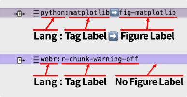

# Chunks and Graphs {#sec-chunks-and-graphs }
 
 1. R chunk and Python chunk notes
    You can create a pRChunk for an R chunk and a pPChunk for a Python chunk. The “Chunk & Graph: Make Chunk List” stamp generates a tag like <Lang:Tag Label➡️Figure Label>.
These tags can be used to reference R chunks, Python chunks, Mermaid diagrams, or Graphviz code.
    Please do not insert tags in the middle of a sentence.

 
If tags called in your notes are changed or deleted, the warning is shown.
You can suppress the warning with  `$SuppresTagDetectWaring` in the project container note.

2. Rendered Preview in Text Pane(R chunks, Python chunks, Mermaid diagrams, and Graphviz only)
You can check the results of the code executed within an R chunk in the Preview screen. Similarly, the results of Python chunk and Mermaid and Graphviz code can also be displayed.
Since the Python preview runs on Pyodide, errors will occur during the preview if your code includes libraries like Plotly that are not supported by Pyodide. 

