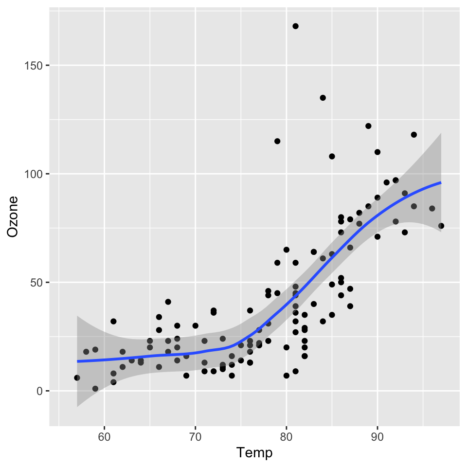

# Cross-Reference using Ziplink {#sec-cross-reference-using-ziplink }

In Quarto, labeled diagrams, tables, etc. can be mutually quoted. Automatically (or manually) collect some labels in the **Tinderbox** file at the bottom of the **Reference List** note. [^regrex]
Convert it to a quotable title (citation name starting with @) and create a note for the corresponding part. **Tinderbox**'s **Ziplink** function [^ziplink] is a function for easily pasting links to notebooks. It is diverted to make it easy to enter the quoted name. This makes it relatively easy to find and enter the quoted label even if the number increases.

[^regrex]: The diagrams and tables are extracted in regular expressions.


[^ziplink]: Please refer to "Text link creation via the Ziplinking method" in [A Tinderbox Reference File](https://acrobatfaq.com/atbref10/index/Automating_Tinderbox/Coding/Links/Text_Links/Text_link_creation_via_the_Ziplinking_method.html).(@Anderson2024Tinde)


## How to set the label of the diagram {#sec-how-to-set-the-label }


### Image link in markdown format {#sec-image-link-in-markdown-format }

Recognize and collect labels in a format that extends the markdown.
\!\[Test image](screenshots/toolbar.png){#fig-test fig-alt="test" fig-align="left" width=100%}

{#fig-test fig-alt="test" fig-align="left" width=100%}


## R chunk {#sec-r-chunk }

Automatically recognize and collect R chunk labels in the following format (#| label: fig-xxx-ooo, etc.). The method of specifying a label in the curly bracket ({r fig-xxx-ooo}) is not supported. In the following example, you can quote @fig-airquality.


::: {.cell}

```{.r .cell-code}
library(ggplot2)
ggplot(airquality, aes(Temp, Ozone)) + 
  geom_point() + 
  geom_smooth(method = "loess")
```

::: {.cell-output-display}
{#fig-airquality width=480}
:::
:::


## Python chunk


::: {.cell}

```{.python .cell-code}
import matplotlib.pyplot as plt
import numpy as np

x = np.random.normal(170, 10, 250)
plt.hist(x)
plt.show()
```

::: {.cell-output-display}
{#fig-python width=480}
:::
:::


## How to set the label of the table {#sec-how-to-set-the-label-of-the-table }

There are multiple ways to specify labels, but they are only supported if it is a table in markdown format and the label name is above, as shown in the example below.[^table-cross-ref]

[^table-cross-ref]: For other formats, please refer to [quarto cross-reference](https://quarto.org/docs/authoring/cross-references.html#tables).


```{.txt}


:明度・彩度の修飾子 {#tbl-brightness-saturation}

 
|項目|効果|
|----|------------|
|dark|暗くする|
|darker|より暗くする|
|darkest|最も暗くする|
|light| 明るくする|
```


:明度・彩度の修飾子 {#tbl-brightness-saturation}

 
|項目|効果|
|----|------------|
|dark|暗くする|
|darker|より暗くする|
|darkest|最も暗くする|
|light| 明るくする|


## Equations {#sec-equations }

Equation Example
Black-Scholes (@eq-black-scholes) is a mathematical model that seeks to explain

$$
ma^{2} \mathrm S^{2}
\frac{\partial^{2} \mathrm C}{\partial \mathrm S^2}  + \mathrm r \mathrm S \frac{\partial \mathrm C}{\partial \mathrm S}\ =  \mathrm r \mathrm C 
$$ {#eq-black-scholes}


```latex

$$
ma^{2} \mathrm S^{2}
\frac{\partial^{2} \mathrm C}{\partial \mathrm S^2}  + \mathrm r \mathrm S \frac{\partial \mathrm C}{\partial \mathrm S}\ =  \mathrm r \mathrm C 
$$

```


## How to quote {#sec-how-to-quote }

If you enter two square brackets "[[", the list will be displayed, so please enter a part of the label name. As the candidates are narrowed down, select the citation label you want to enter.


:How to quote

|Types of quotations  |Lable  |Quote|
|---|---|---|
|Chapters, Sections etc.   |#sec-   |\@sec-|
|Figures  |#fig- <br>#\| label:fig-<br>%%\| label:fig-<br> \/\/\| label:fig-<br>   |\@fig-|
|Charts　|#tbl-|\@tbl-|
|Equations | #eq-| \@eq-|


## Dummy links for cross-reference {#sec-add-dummy-links-to-cross-ref }

You can create dummy links showing where each cross-reference, starting with the @ symbol in the section, figure, and table label lists, is cited.


1. execute the "Labels: Make Dummy Link Data For Cross-Reference" stamp


2. select cross-ref label notes ( start with "@" ) and execute the "Labels: Dummy Link between Reference and Selected notes" stamp.


## Restrictions on quoted labels {#sec-restrictions-on-quoted-labels }


* The label before change or deletion remains because it cannot be detected even if the quoted label name is changed or deleted.


* Cross-ref detection is carried out by regular expression. If it is executed in the middle of input, it will be duplicated with a short label.

In this case, if necessary, delete the quoted label name in Stamp and perform the detection manually by following the steps below.


1. Labels: Clear Cross-Reference List（Delete all citation labels under the Reference List.）


2. Labels: Make Cross-Reference List（Re-detect the quoted label.）


