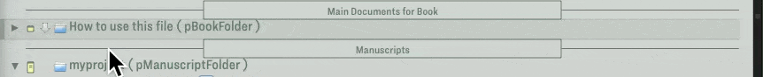
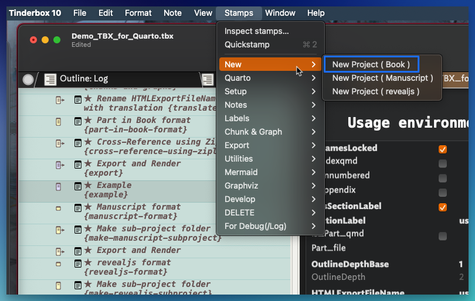
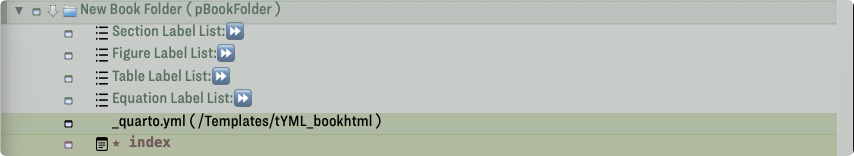

# Make a New Book Project
 
 1. create a new note for pBookFolder.
 

 
 

2. Execute the "Make a New Book Project" stamp.
　
 
　Label lists, _quarto.yml, and  index note are created.
 
　
 
If you use a virtual environment with Python and the stamps about quarto command, please set $VenvActivateCommand.
Before calling quarto commands, the stamps activate the virtual environment.

